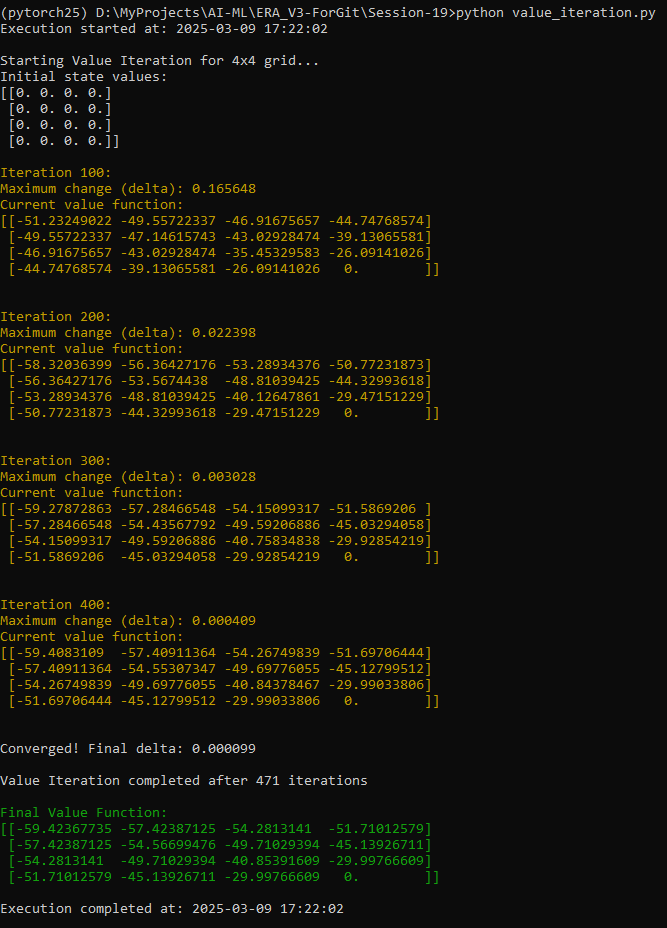
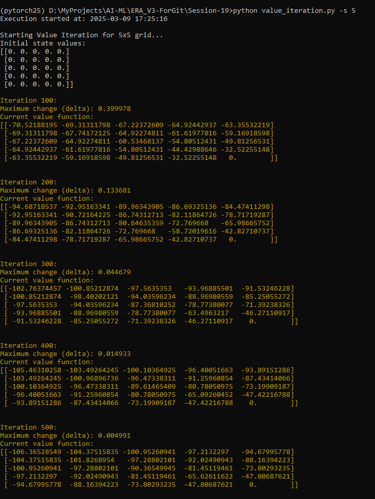
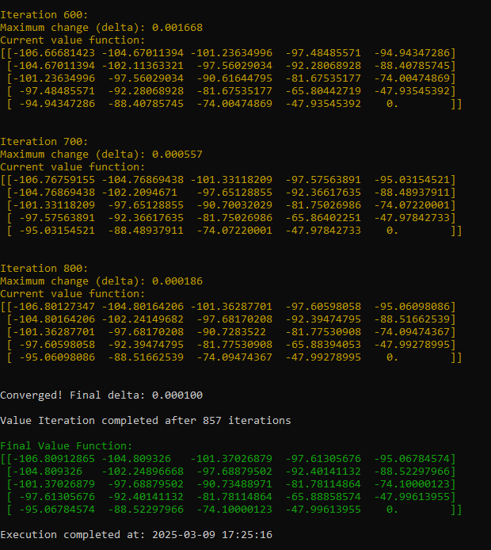

[← Back to README](README.md)

# Actual Program Outputs

This page shows the actual outputs from running the Value Iteration algorithm with different grid sizes.

## 4x4 Grid Output

Running command: `python value_iteration.py -s 4`

## 5x5 Grid Output

Running command: `python value_iteration.py -s 5`

### Initial Iterations

### Final Convergence

Note: The color-coded output shows:
- Progress updates in yellow
- Final converged values in green
- Regular output in standard terminal color 

[← Back to README](README.md) 